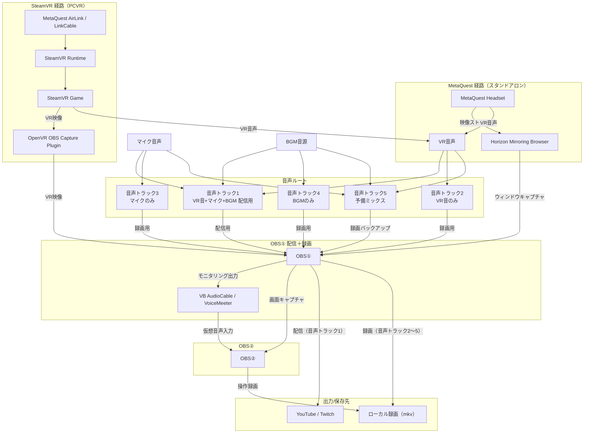

```mermaid
flowchart TD

%% ==============================
%% META QUEST 経路（スタンドアロン）
%% ==============================
subgraph A[MetaQuest 経路（スタンドアロン）]
    MQ[MetaQuest Headset]
    HM[Horizon Mirroring Browser]
    MQ -->|"映像ストリーム"| HM
    MQ -->|"VR音声"| AUDIO
end

%% ==============================
%% SteamVR 経路（PCVR）
%% ==============================
subgraph B[SteamVR 経路（PCVR）]
    MQ2[MetaQuest AirLink / LinkCable]
    SVR[SteamVR Runtime]
    VRG[SteamVR Game]
    OVC[OpenVR OBS Capture Plugin]

    MQ2 --> SVR
    SVR --> VRG
    VRG -->|"VR映像"| OVC
    VRG -->|"VR音声"| AUDIO
end

%% ==============================
%% 音声ルート構成
%% ==============================
AUDIO[VR音声]
MIC[マイク音声]
BGM[BGM音源]

subgraph F[音声ルート]
    TRACK1[音声トラック1\nVR音+マイク+BGM 配信用]
    TRACK2[音声トラック2\nVR音のみ]
    TRACK3[音声トラック3\nマイクのみ]
    TRACK4[音声トラック4\nBGMのみ]
    TRACK5[音声トラック5\n予備ミックス]
end

AUDIO --> TRACK1
MIC --> TRACK1
BGM --> TRACK1

AUDIO --> TRACK2
MIC --> TRACK3
BGM --> TRACK4

AUDIO --> TRACK5
MIC --> TRACK5
BGM --> TRACK5

%% ==============================
%% OBS構成
%% ==============================
subgraph C[OBS① 配信＋録画]
    OBS1[OBS①]
    VB[VB AudioCable / VoiceMeeter]

    HM -->|"ウィンドウキャプチャ"| OBS1
    OVC -->|"VR映像"| OBS1

    TRACK1 -->|"配信用"| OBS1
    TRACK2 -->|"録画用"| OBS1
    TRACK3 -->|"録画用"| OBS1
    TRACK4 -->|"録画用"| OBS1
    TRACK5 -->|"録画バックアップ"| OBS1

    OBS1 -->|"モニタリング出力"| VB
end

%% ==============================
%% OBS②（チュートリアル／操作録画用）
%% ==============================
subgraph D[OBS②]
    OBS2[OBS②]
    VB -->|"仮想音声入力"| OBS2
    OBS1 -->|"画面キャプチャ"| OBS2
end

%% ==============================
%% 出力/保存先
%% ==============================
subgraph E[出力/保存先]
    YT[YouTube / Twitch]
    REC[ローカル録画（mkv）]

    OBS1 -->|"配信（音声トラック1）"| YT
    OBS1 -->|"録画（音声トラック2〜5）"| REC
    OBS2 -->|"操作録画"| REC
end


classDef note fill:#fff7cc,stroke:#b89b00,stroke-width:1px,color:#000;
class NOTE note;

```