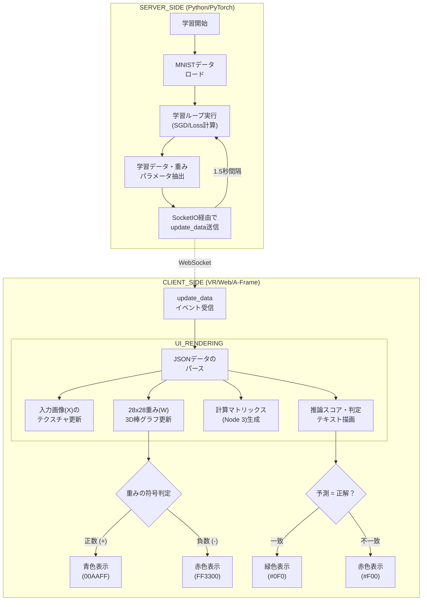

### システム概要
本システムは、MNISTデータセットを用いた単層ニューラルネットワーク（線形モデル）の学習過程を、VR（A-Frame）空間上でリアルタイムに可視化するWebアプリケーションである。学習の各ステップにおける入力データ、重み、計算過程、推論結果を3D空間内に配置し、AIの内部計算を直感的に「点検」することを目的とする。

### 機能仕様

1.  **リアルタイム学習エンジン**
    * PyTorchを用いた線形モデル（784入力、10出力）のSGD学習。
    * MNIST画像を1枚ずつ学習（Batch Size = 1）し、各ステップのパラメータを抽出。
2.  **3Dビジュアライゼーション**
    * **INPUT (X):** 元の入力画像をVR空間内の平面に表示。
    * **WEIGHTS (W):** 特定ノード（Node 3）の重みを28x28の3D棒グラフとして描画。
    * **DETAILED CALCULATION:** 入力値と重みの積 ($x \times w$) の算出過程をマトリックス形式でログ表示。
    * **OUTPUT (Y):** 10クラスのスコア、バイアス、判定結果（予測 vs 正解）を表示。
3.  **データ通信**
    * Flask-SocketIOによる双方向リアルタイム通信。
    * 画像データのBase64エンコード転送および数値データのJSON配信。

### 動作仕様

| 項目 | 内容 |
| :--- | :--- |
| **学習ループ** | 2ステップ毎に情報を抽出し、1.5秒の間隔を空けてフロントエンドへ送信。 |
| **重み表示** | 重みが正の場合は青色、負の場合は赤色で3Dバーの高さを変化させる。 |
| **判定表示** | 推論値（P）と正解ラベル（A）を比較し、一致すれば緑色、不一致なら赤色で表示。 |
| **VR環境** | A-Frameを使用し、ブラウザ上で全方位視点操作およびVRヘッドセット対応を実現。 |

---

### 処理フローチャート

